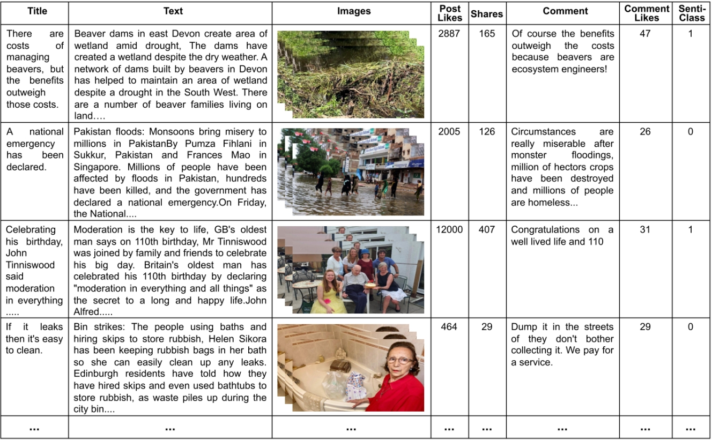
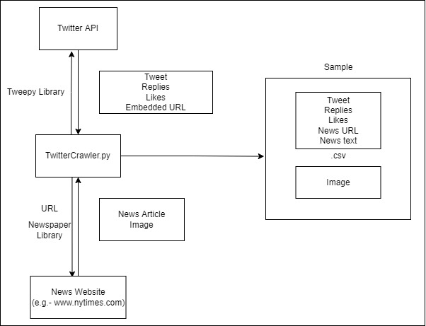
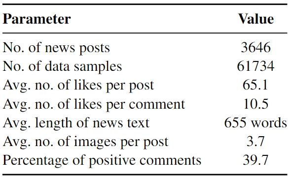

CMFeed: A Benchmark Dataset for Controllable Multimodal Feedback Synthesis
================================================

Implementation for the paper (submitted to NeurIPS 2024 Datasets and Benchmarks Track).  
**[Affective Feedback Synthesis Towards Multimodal Text and Image Data][1]** 
[Puneet Kumar](https://puneet-kr.github.io/), [Sarthak Malik](https://www.linkedin.com/in/sarthak-malik-03777a190/), [Balasubramanian Raman](http://faculty.iitr.ac.in/~balarfma/) and [Xiaobai Li](https://www.oulu.fi/en/researchers/xiaobai-li). 

## Code Files
The code files are currently private and will be made public after the acceptance/publication of the corresponding paper. 

Dataset Details & Access
-------------------------
The [`Controllable Multimodal Feedback Synthesis (CMFeed) Dataset`][2] dataset' has been compiled by Puneet Kumar and Sarthak Malik under the supervision of Prof. Balasubramanian Raman and Prof. Xiaobai Li. It contains $61734$ samples from $3646$ posts compiled by crawling news articles from Sky News, NYDaily, FoxNews, BBC News, and BBC NW through Facebook posts. It consists of multiple images per sample, corresponding news text, post likes and shares, and human comments. The comments for each post have been sorted based on Facebook's 'most-relevant' criterion.

Representative samples from the CMFeed dataset are shown in the following figure where 'Post Likes' and 'Comment Likes' show the number of likes for the post and comment, respectively. 'Share' denotes post shares and `Senti-class' represents comment's sentiment ($1$: positive, $0$: negative).
 

The process to crawl the data from Twitter feeds is depicted in the following diagram:
<!---->

Various parameters of the CMFeed dataset have been described in the following Table.

Access to the CMFeed dataset can be obtained by through [`Access Form - CMFeed Dataset.pdf`][2].   

[1]: https://neurips.cc/Conferences/2024/CallForDatasetsBenchmarks
[2]: https://github.com/MIntelligence-Group/CMFeed/blob/main/Access%20Form%20-%20CMFeed%20Dataset.pdf
