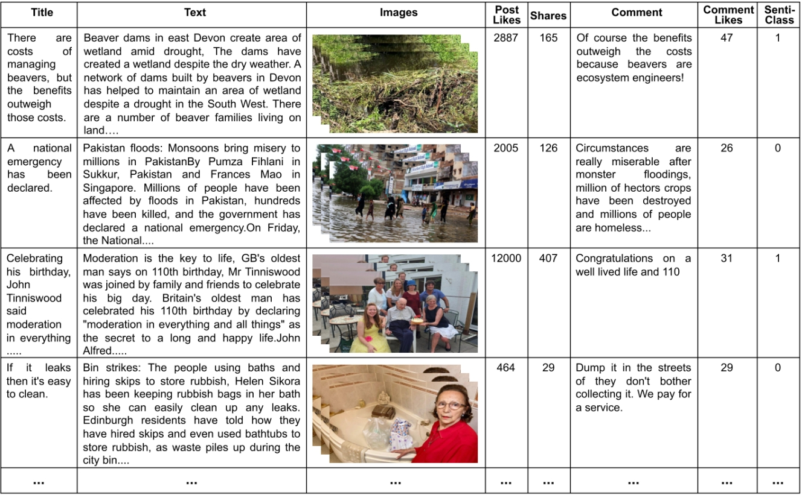

# CMFeed: A Benchmark Dataset for Controllable Multimodal Feedback Synthesis

Implementation for the paper submitted to NeurIPS 2024 Datasets and Benchmarks Track.  
**[CMFeed: A Benchmark Dataset for Controllable Multimodal Feedback Synthesis][1]**  
[Puneet Kumar](https://puneet-kr.github.io/), [Sarthak Malik](https://www.linkedin.com/in/sarthak-malik-03777a190/), [Balasubramanian Raman](http://faculty.iitr.ac.in/~balarfma/), and [Xiaobai Li](https://www.oulu.fi/en/researchers/xiaobai-li). 

## Code Files
The code files are currently private and will be made public after the acceptance/publication of the corresponding paper. 

## Dataset Details & Access
The [Controllable Multimodal Feedback Synthesis (CMFeed) Dataset][2] has been compiled by Puneet Kumar and Sarthak Malik under the supervision of Prof. Balasubramanian Raman and Prof. Xiaobai Li. It contains 61,734 samples from 3,646 posts compiled by crawling news articles from Sky News, NYDaily, FoxNews, BBC News, and BBC NW through Facebook posts. The dataset includes multiple images per sample, corresponding news text, post likes and shares, and human comments. The comments for each post have been sorted based on Facebook's 'most-relevant' criterion.

### Compliance with Facebook's Terms & Conditions
This data has been collected manually from news websites and corresponding Facebook posts in the public domain, adhering to [Facebook's terms and conditions][3]. Facebook prohibits the automatic scraping of its users' personal data. In compliance with this policy, we implement the following steps while constructing the CMFeed dataset:
1. **Manual Data Crawling:** All data is manually collected from Facebook, ensuring strict avoidance of any automated scraping processes. This is in-line with the [guidelines for Facebook data scraping][4].
2. **Public Data Collection:** We collect data that is publicly available, specifically corresponding to news articles that are freely accessible following the [protocols for ethically scraping Facebook data][5].

## Steps Involved in Data Collection
The following steps outline the comprehensive process used for collecting and preparing the CMFeed dataset, ensuring the dataset is of high quality and suitable for controlled multimodal feedback synthesis.

#### Step 1: Manual Crawling of Facebook News Pages
- **Objective**: Manually extract essential data elements from publicly available Facebook news pages.
- **Data Collected**:
  - `News_text`: The textual content of each news post.
  - `News_link`: Direct URL to the full news article.
  - `Post_shares`: Total number of shares the post received.
  - `Post_reaction`: Count of reactions (like, love, etc.) on the post.
  - `Comment`: Text content of top-ranked comments.
  - `Comment_like`: Like count for each comment.
  - `Comment_reaction_rank`: Ranking of comments based on reaction counts.
  - `Comment_link`: Direct URL to specific comments, if available.
  - `Comment_rank`: Ranking of comments based on overall engagement and relevance.

#### Step 2: Extraction of News Content via Web Browser
- **Tools Used**: Selenium WebDriver, controlled manually.
- **Procedure**:
  - Manually operate a web browser script to visit each `News_link`.
  - Manually collect all images present on the news article page for each link visited.

#### Step 3: Complete Data Collection from Online Sources
- **Objective**: Compile all collected data, including human feedback elements.
- **Data Aggregated**:
  - Combine manually gathered Facebook data with images collected from news articles to complete the dataset.

#### Step 4: Sentiment Analysis Using Advanced NLP Models
- **Models Utilized**:
  - FLAIR
  - SentimentR
  - RoBERTa
  - DistilBERT
- **Procedure**:
  - Process collected comments through the four sentiment classification models.
  - Generate binary sentiment scores (`0`: negative, `1`: positive) and corresponding probability scores for each comment.

#### Step 5: Calculate Combined Sentiment Scores
- **Objective**: Derive a refined sentiment classification for each comment.
- **Procedure**:
  - Use weighted addition to combine binary scores and probability scores from all models, forming a final `Sentiment_class` and `Sentiment_score` for each comment.

#### Step 6: Implement Data Filtering Strategies
- **Objective**: Enhance the reliability and accuracy of the dataset.
- **Filtering Methods**:
  - **Model Agreement Filtering**: Only retain comments where at least three out of the four models concur on the sentiment.
  - **Probability Range Safety Margin**: Exclude comments with sentiment probabilities between 0.49 and 0.51, indicating ambiguous or uncertain sentiment determinations.

This approach adheres strictly to manual operations to comply with data collection regulations, ensuring a robust and reliable dataset for controllable multimodal feedback synthesis.
<!-- -->

## Data Samples and Further Details 

Various parameters of the CMFeed dataset have been described in the following table.

Representative samples from the CMFeed dataset are shown in the following figure where 'Post Likes' and 'Comment Likes' show the number of likes for the post and comment, respectively. 'Share' denotes post shares and `Senti-class` represents comment's sentiment (`1`: positive, `$0`: negative).

 

Access to the CMFeed dataset can be obtained at [https://zenodo.org/records/11409612][2].

[1]: https://neurips.cc/Conferences/2024/CallForDatasetsBenchmarks
[2]: https://zenodo.org/records/11409612
[3]: https://developers.facebook.com/terms/
[4]: https://www.facebook.com/help/463983701520800
[5]: https://webscraping.blog/how-to-scrape-facebook/
